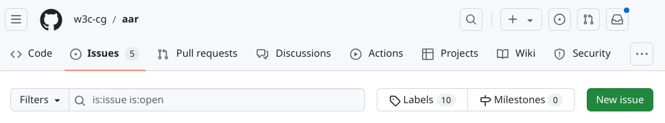

# Advancing Accessibility Resources Community Group

Our goal is to engage and empower accessibility professionals to advance the [W3C WAI](https://www.w3.org/WAI/) mission through _community_ driven initiatives. This work could include:

* Creating and maintaining a repository of community-built resources that complement WAI
* Being a group of active participants that are continually contributing to resources
* Vetting and highlighting external resources that relate to and support this group's resources
* Being available to W3C Working Groups and Task Forces to assist in writing specifications and resources

This community group is in its infancy, and as such has not published* any resources yet. The resouces that are currently being worked on can be found on our [Current Resource Work](https://github.com/w3c-cg/aar/wiki/Current-Resource-Work) wiki page. 

We welcome contributions from the accessibility community and others with an interest in accessibility, either through comments and issues in this repository, or as a member of the [AAR community group](https://www.w3.org/community/adva11yresources/).

\* The AAR CG will maintain its own website of 'published' materials. No resources from this group will be published on the WAI website unless agreed upon prior to, or during development of the resource. Publishing on the WAI website will be entirely at the descretion of the W3C staff in charge of WAI. 

## How to contribute

No matter what capacity you wish to contribute, we will be using GitHub as our main source of ideation, conversation, and ultimately published materials. Suggestions, updates, edits, or new material should be brought forth either through [issues](https://github.com/w3c-cg/aar/issues) or [pull requests](https://github.com/w3c-cg/aar/pulls) (PRs).

*Note:* Please read the [CONTRIBUTING](./CONTRIBUTING.md) guide before making any PRs.

### GitHub issues

Creating a GitHub issue is the easiest way to contribute. 

1. From the [issues](https://github.com/w3c-cg/aar/issues) page, select the "New issue" button

2. Choose an issue template that meets the type of issue you wish to raise ("New resource suggestion", "Resource updates and suggestions", "Scope updates and suggestions", etc.). If no issue templates suit your issue, select the "Open a blank issue" link.

3. Fill out the issue template with as much information as possible, so that it is easy to pinpoint what you are referring to and what you would like to add/edit/update/etc.

For example, if you have a suggestion to update a resource, provide an issue title that briefly outlines the update (leave the information in the square brackets as is - [RESOURCE UPDATE], for instance). Then in the body of the issue provide the name of the resource, what the existing text states (if applicable), what you would like the text to be updated to, and your rationale for the addition or change.

4. Press the "Submit new issue" button.

### GitHub pull requests

*_Coming soon_*

